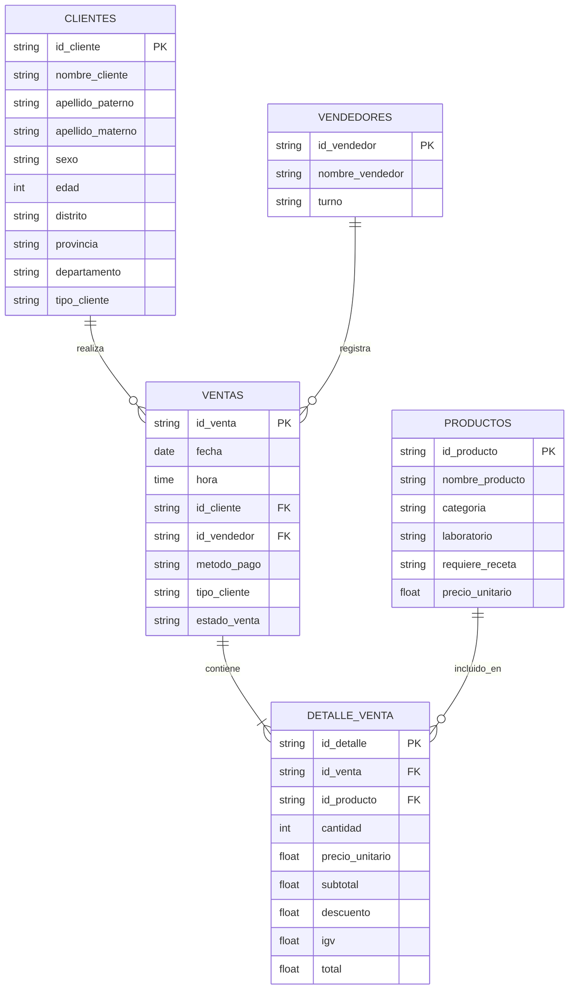

# DISEÑO TRANSACCIONAL Y DIAGRAMA E-R (MARFARMA)

## Análisis del requerimiento "5D-Transaccional"
Al revisar el material oficial (Sílabo y Desafío del Curso de Bases de Datos Avanzadas y Big Data), **no existe una definición o referencia explícita a un modelo "5D-Transaccional"**. Por consiguiente, basándonos en la prohibición de inventar interpretaciones sin sustento, asumimos que este requerimiento hace referencia a las **5 entidades (Dimensiones transaccionales) principales** extraídas de nuestro dataset: **Clientes, Productos, Vendedores, Ventas y Detalle de Venta**, las cuales formarán la base del diseño transaccional y el posterior Data Warehouse.

## Entidades y Relaciones

1. **CLIENTES:** Almacena la información de los clientes (id_cliente [PK], nombre, apellidos, sexo, edad, ubicación, tipo).
2. **PRODUCTOS:** Almacena el catálogo de medicamentos y productos (id_producto [PK], nombre, categoría, laboratorio, requiere_receta, precio_unitario).
3. **VENDEDORES:** Registra al personal de caja/farmacia (id_vendedor [PK], nombre, turno).
4. **VENTAS:** Cabecera de la transacción. Relaciona al Cliente y al Vendedor. (id_venta [PK], fecha, hora, id_cliente [FK], id_vendedor [FK], metodo_pago, tipo_cliente, estado_venta).
5. **DETALLE_VENTA:** Detalle de productos por venta. (id_detalle [PK], id_venta [FK], id_producto [FK], cantidad, precio_unitario, subtotal, descuento, igv, total).

## Justificación de Normalización (Tercera Forma Normal - 3FN)
- Se han separado las cabeceras (`VENTAS`) de los ítems (`DETALLE_VENTA`), evitando la redundancia de datos de cliente, vendedor y fecha por cada producto comprado.
- Los atributos de las entidades dependen únicamente de su clave primaria, eliminando dependencias transitivas.
- No se han agregado entidades artificiales adicionales (ej. Laboratorios o Categorías como tablas separadas en el relacional) dado que el dataset base las incluye como atributos descriptivos, aunque podrían normalizarse más (Copo de Nieve) en el Data Warehouse si es necesario.

## Diagrama E-R (Mermaid)

