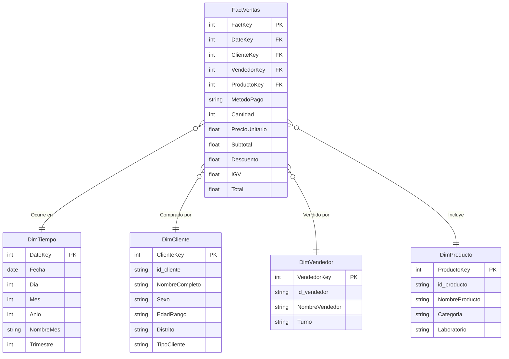
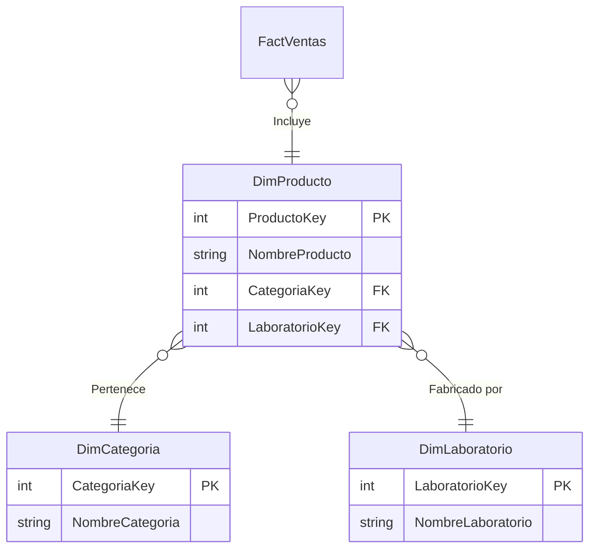

# MODELO DIMENSIONAL - MARFARMA DW

## 1. Esquema Estrella (Star Schema)
El esquema estrella fue el implementado físicamente en la base de datos `MARFARMA_DW`. Consiste en una tabla de hechos central `FactVentas` rodeada por tablas de dimensiones desnormalizadas, lo cual optimiza la velocidad de las consultas analíticas reduciendo el número de JOINs requeridos.

## 2. Esquema Copo de Nieve (Snowflake Schema)
Es una variante más normalizada del esquema estrella. En este modelo, las dimensiones con jerarquías (como Producto -> Categoría/Laboratorio o Cliente -> Ubicación) se separan en múltiples tablas afines.

## 3. Diferencias y Justificación Metodológica (Kimball vs Inmon)
En este proyecto aplicamos la metodología **Bottom-Up de Ralph Kimball**, que se enfoca en entregar valor rápido mediante la construcción de Data Marts (como nuestro caso de Ventas) utilizando esquemas estrella descentralizados pero con dimensiones conformadas. 
- **Estrella vs Copo de Nieve:** Elegimos el esquema estrella por su mayor rendimiento de lectura en herramientas BI (como Power BI) y simplicidad de diseño. El modelo copo de nieve reduce redundancia de datos (espacio), pero a costa de degradar el rendimiento por el incremento de operaciones JOIN complejas en el motor OLAP.
